# twitter_automation
Simple Twitter Automation Examples
What's the point?
Ever wonder how there are so many Tweets being posted every minute? 

Well, the simpler answer is that there is a ton of people on Twitter all the time. However, the more complex one involves that a lot of those users are either automating a lot of the interactions or paying a service provider to push content to Twitter for advertisement and brand awareness, etc to Twitter on behalf of the user. These providers themselves are using automation and progamming languages in order to accomplish the same thing. 

How hard is it really to be able to create my own little tweeting machine? It turns out, not very hard. As you can see on the right, you can make a ton of noise with not a ton of effort. Let's take a look.

What do we need for this...
For this exercise, we are going to need a computer, Python installed on that computer, and a developer environment (PyCharm). If you are familiar with the Python programming language and you have another dev. environment that you prefer that is ok too. 
 
For installing Python and PyCharm, there is a ton of tutorial and videos on youtube. You must install Python first and PyCharm after.
 
Now for this exercise...

Twitter Automation Starting Guide!!!

Step 1. Signup for a Twitter developer account.

Navigate to www.developer.twitter.com, create a developer account. See capture below...

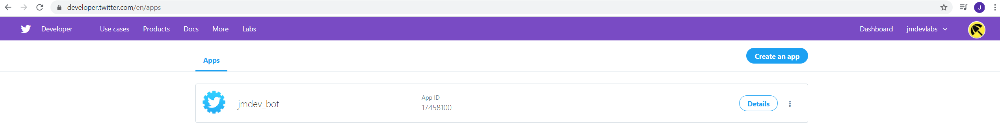

Step 2. Create a Twitter app.

Don’t worry, no actual code is needed, yet. All that is necessary here is to fill out the information and answer the questions that will aid the Twitter admins who are reviewing your app request. Try to make your answers as descriptive as possible. Approval can take a couple of days, while you are waiting you can go ahead and install python and the development environment on your machine.

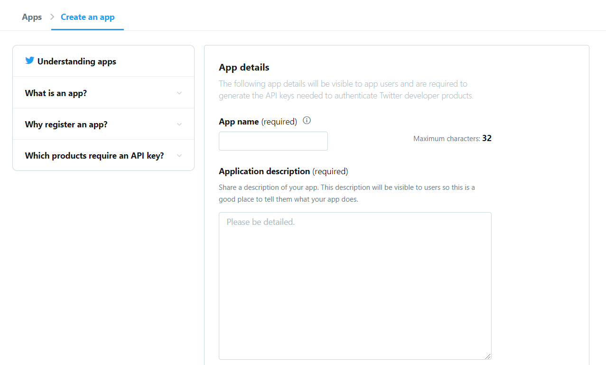

Step 3. Find your Keys and Tokens

Once your app creation request is approved you will be notified via email. Alternatively, you can come back to the site and check the status. At this point, you will need to go into the app by clicking on the name and in the app options find the Keys and Tokens tab. There will be 4 long strings of letters and numbers. For this exercise, we will need all 4. Keep in mind that the Access token and secret are only visible when you first create them, so make sure you copy and paste them somewhere. 

Step 4. Download and install Python and the dev. environment. 

Links to where to find and download Python and PyCharm provided here... 

https://python.org/downloads/

https://www.jetbrains.com/pycharm/download/

To download python you can simply go to link above and download the correct version based on your OS. For Linux based OS there are other ways to download python, I will assume you know what those are, or else you can just google: download python 3 on Linux. After downloading python 3 (not 2.xx –also I never download the latest, I usually stay 1 or 2 versions behind the latest) install it, default parameters are fine. 

Next, and this will be the most challenging part of this exercise aside from the coding portion, you will need to download a developer environment in which you will use the python code provided to automate Twitter updates and interactions. I recommend using, in my opinion, what I believe to be the best and most intuitive environment out there –PyCharm. You can download it from the link provided above. You do not need the professional version, the community version will suffice. There are installation instructions on the site. Once downloaded, you will be asked to create a new project upon the first time opening PyCharm. You can name this project whatever you like. It is very important to make sure that you have a python interpreter selected for this project. Here is how to check...

Go to File > Settings > Project: “name” > Python Interpreter. Make sure that the Python Interpreter path is filled with the location where you installed python. If this is blank, click on the cogwheel on the right and add the path on the prompt window. See below capture for reference...

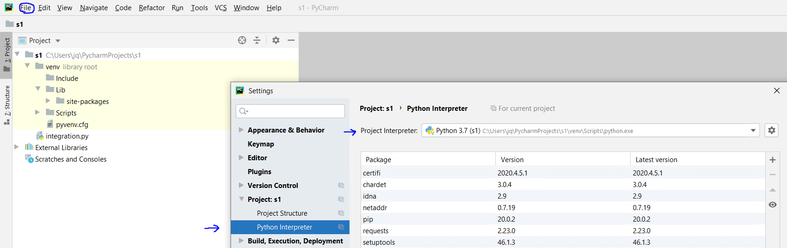

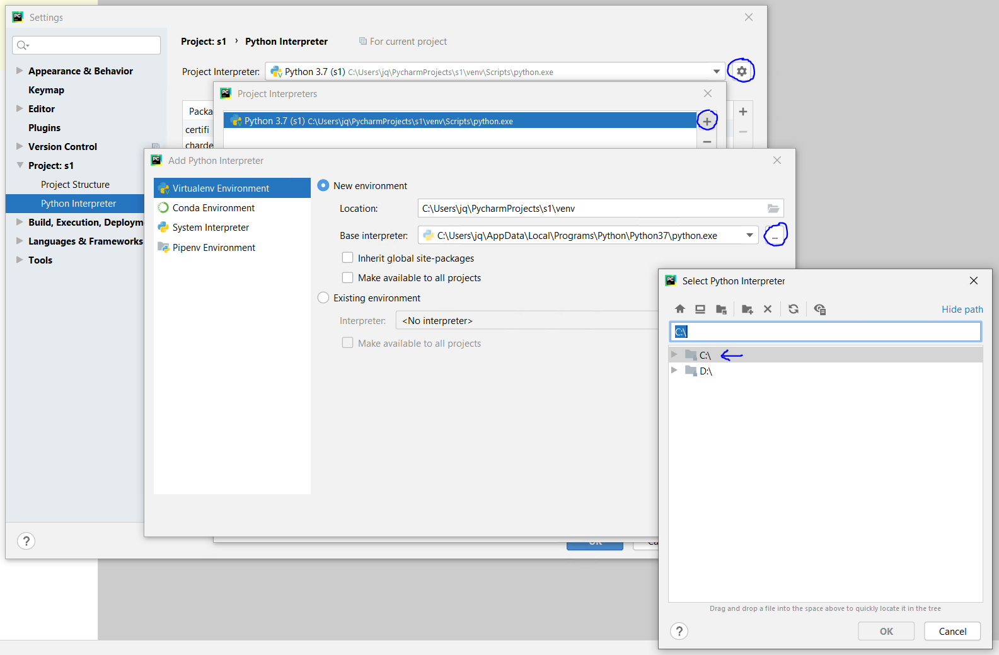

Once this is all done, you should be good to go. Time for the fun part 😊.

Step 5. Let's code.

First, let's get an idea of the project structure. You should have an environment folder already there. This is the name you chose when you installed PyCharm. Right-click on it and create another folder called “bot” <-- the actual name is not important. 

Inside this “bot” folder we are going to create another folder “photos” and 6 python files. To do this, we again right-click on the bot folder and create a NEW directory “photos”, and 6 python files: “autoreply”, “fav”, “follow”, “update”, “update_custom”, and “config”. The names don’t matter. As a rule of thumb, you should choose a name that is short and indicative of what the file does. Since you will be referencing some of these names, the longer the name is, the higher the chance that you will make a spelling mistake. 

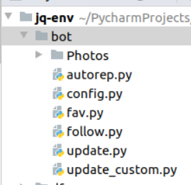

Step 6. Configure your development keys.

The config.py file will house all the dev keys that we got from the Twitter site where we created our app. 

We will write the code as follows: Import the libraries needed to make this work, at first there will be a red line underneath them. Right-click on each and select import. PyCharm will go and get the libraries for you, this is why we chose this developer environment. 

The code should look like the capture on the right. Make sure to paste the keys from the twitter site. Punctuation and spacing matters, if there is an error you will get a red line underneath the error.

The config file is complete. This file will be referenced by the others which we will create next. 

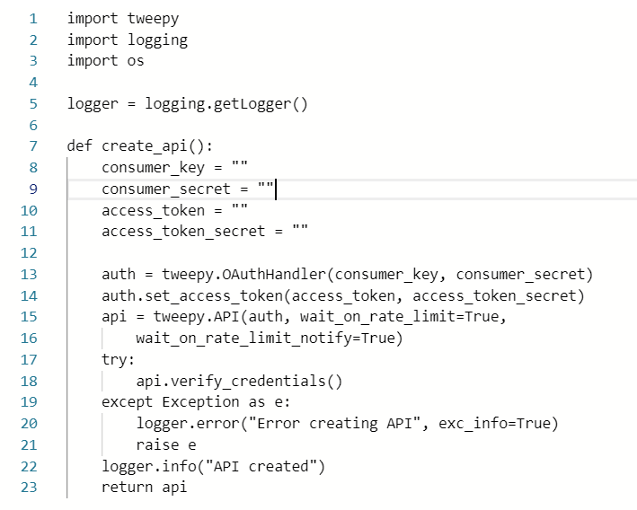

Step 7. Creating the update.py file.

Update.py will be how you write new tweets automatically to twitter every so often. You can customize everything from the context of the tweet to the hashtags and also add links to sites and/or pictures. Let’s see how that is done. 

As with the config.py file, we will first import the necessary libraries. Then, we will create some variables that we will use in our function that does the tweeting. 

In python the # symbol at the beginning of a line is used for comments in the code, this means that the line preceded by a # sign will be ignored by the code. I will include some comments in this next code snippet to better explain what is happening, they don’t need to be in your implementation of the code. 

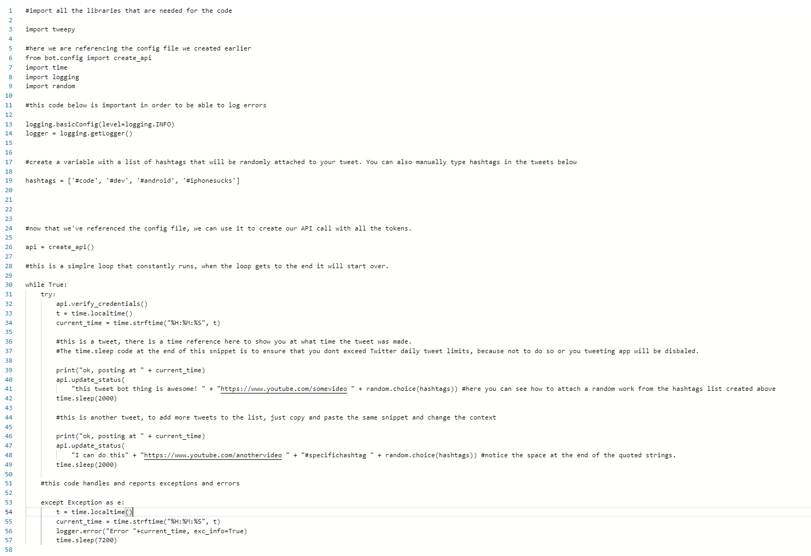

At this point, we can try and run the code. To do so right-click on any of the two spots annotated with arrows on the capture below, or click the play button next to the code on the top right to play the script. For the last option make sure that the code that is selected is the one you want to execute.

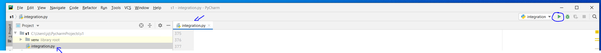

After running the program, check your twitter feed. If you did it right, there should be some tweets there. For testing purposes, you can minimize the sleeping intervals. To stop, any script you will go to the same place that you would for starting the script, there you will have the option to stop it.

Step 8. Posting with photos.

OK, now that we have a working bot, let add some media to our posts. The code for this is very similar to the code for the update.py file. For this code, we are going to add a picture to each tweet, either randomly selected or specifically assigned. 

Before we do any code writing, we will go back to that folder “photos” and put some pictures in there. I like to use the PNG format because they are small and easy to manage, JPEG should also work.

The code will look like this…

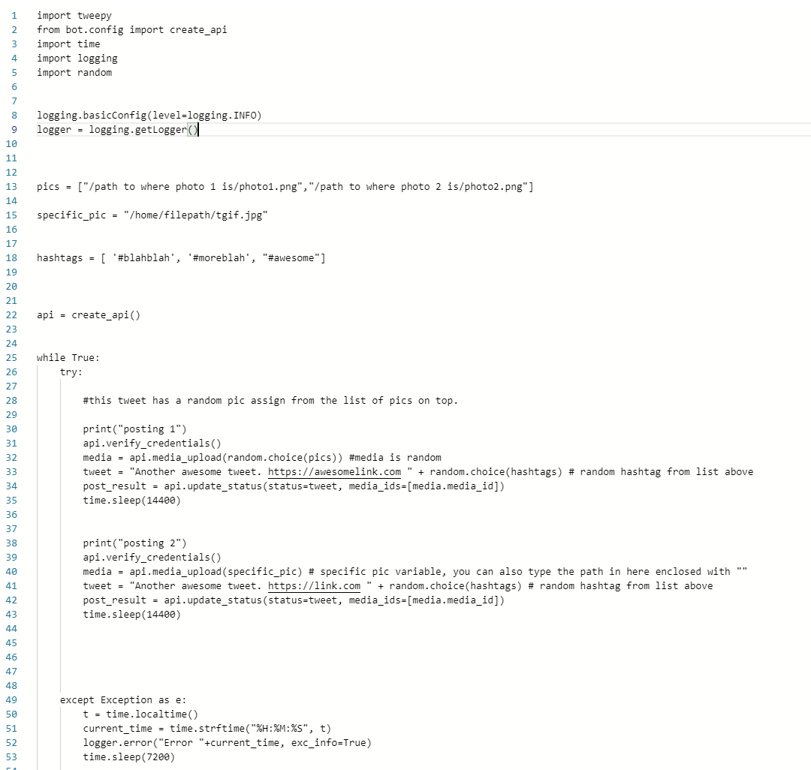

Step 9. Fav and Follow.

OK, so far you are doing great, not only can you post text and links but also photos. Now its time to favorite and follow others, so that they in turn will follow you. For that, we will have a follow.py script and a fav.py script. First, let us look at the simple follow.py code implementation below…

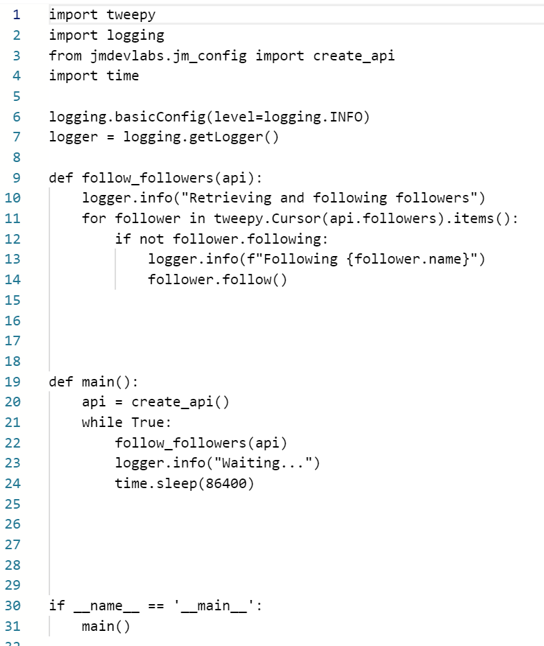

As you can see here, we begin with the usual importing of the libraries needed to execute the code and logging functionality so that we can see errors in the console, even if we have no idea what they mean 😊.

Next, we have a function that retrieves the list of all those who are following you and returns the kindness, if the user is already following you then that user will be skipped. 

WARNING!!!

This implementation of the code is very simple and there are instances where you might encounter an error if a user needs to accept your request to follow them because the program with try to follow them every time the code is executed and if a request for following has already been sent and is awaiting user response, an error will occur. In these cases, the user handle will be printed into the error logging which is visible at the bottom of the PyCharm environment in the console section as shown below… 

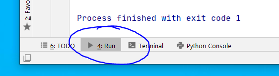

Get the Twitter handle and go to your account and unfollow the user manually. Most users in the Twitter community looking to increase their followers, so this should not happen very often. 

Step 10. How to Favorite and re-tweet tweets from other users. 

This is one of the more involved parts of the code, so I will just paste the implementation below. For it to do what you want, you simply have to give it a list of things you want the program to search for and it will fav tweets that meet the description. See the code below…

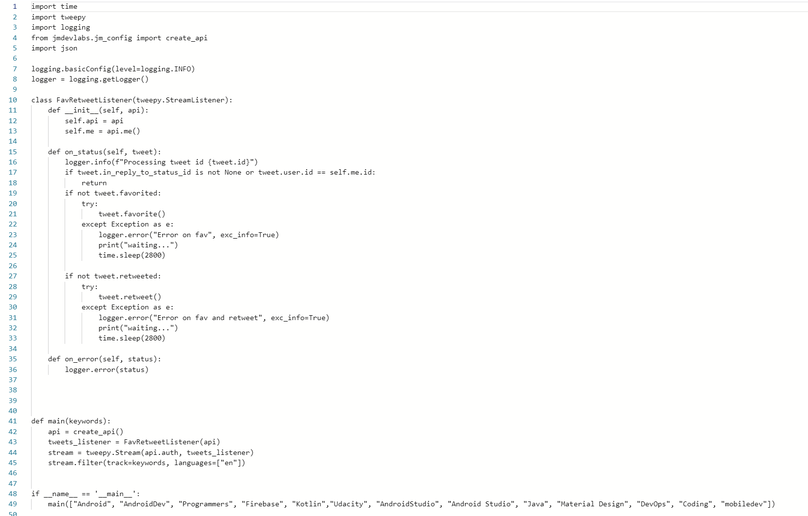

Change the keyword list as needed. Please make sure you add JMDevLabs to your list 😊

From time to time, you will get an error, if the API senses that you’ve reached the limit of tweets for a day or if the program is trying to retweet your own twets too many times. Keep your eye on the script, if you see a CODE 1 EXIT on the console below, just restart it. The sleep time can also be decreased for added activity, but remember that Twitter does not like a ton of spam.

With the exception of the config script, all the other ones have to be "run" for them to work. See the capture at the end of Step 7 for the different ways to run a program in PyCharm, every little python file is a program. Enjoy!!!

I hope you have found this useful. If nothing else, at least now you know how some users can post so many tweets in one day 😊.

J.
